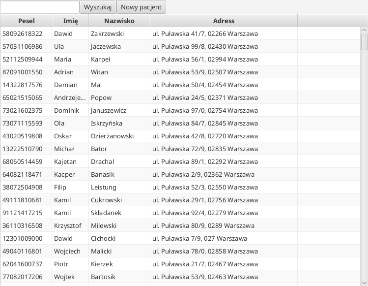
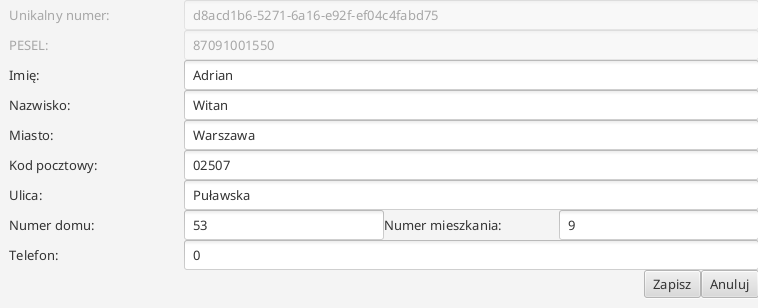
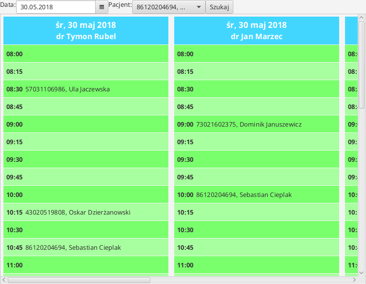
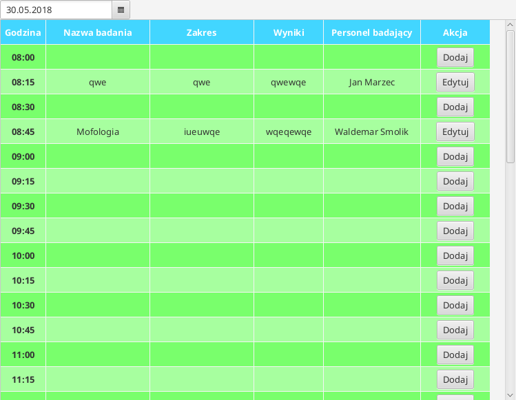
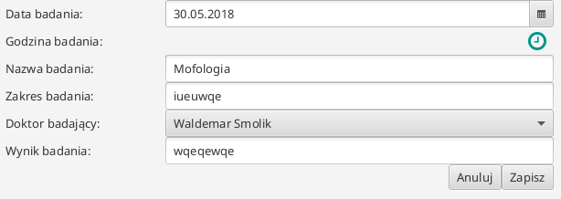
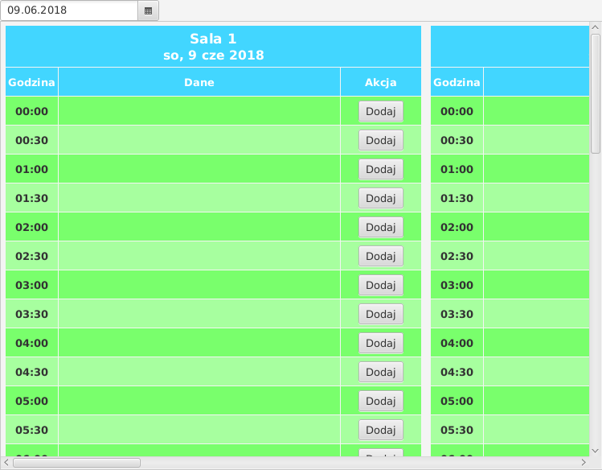
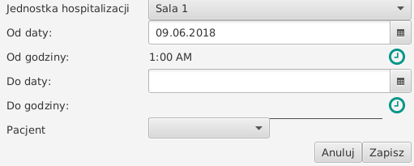

# OSM - Projekt 2

## Działanie

Program składa się z pięciu modułów
 - Pacjenci - moduł słuzący do zarządzania pacjentami
 - Terminarz - moduł do zarządzania terminarmi przyjmowania lekarzy
 - Badania/Zabiegi - do ustalania terminów zabiegów i badań
 - Hospitalizacje - do ustalania hospitalizacji pacjentów
 
### Pacjenci

Moduł pacjetów jest maszyną stanową, z następującymi stanami:
 - lista - tabela z instniejącymi stanami
   - aby wejść w edycje pacjenta, należy kliknąc dwa razy na danego pacjenta
   - aby swtorzyć nowego pacjenta należy kliknąć przycisk "Nowy Pacjent" na górze 
 - nowy pacjent
 - edycja pacjenta

#### Podgląd

WSZYSTKIE DANE OSOBOWE ZAMIESZCZONE NA OBRAZKACH BYŁY WYGENEROWANE LOSOWO

PESEL BYŁ GENEROWANY JAKO LOSOWA DATA, CZTERY LOSOWE CYFRY PLUS WYLICZONA SUMA KONTROLNA

IMIONA I NAZWISKA TO LOSOWA PERMUTACJA IMION I NAZWISK Z KILKU GRUP NA FACEBOOK'U

##### Lista

##### Edycja

### Terminarz

Moduł terminarza pozwala na zapisywanie pacjentów na wizyty z wyprzedzeniem. Czysto teoretycznie, wizyty powinny być definiowane w oddzielnym module, ale za względu na ułatwienia, każdy lekarz przyjmuje codziennie od 8 do 18, siedem dni w tygodniu.

Aby zapisać pacjenta należy go najpierw wybrać z ComboBox'a na górze a następnie kliknąc LPM na wybany termin. Aby usunąc należy kliknąc PPM na wybranym terminie.

#### Podgląd

### Badania/Zabiegi

Moduł badań i zabiegów, podobie jak w terimnarzu, można zapisać pacjentów na badania oraz zabiegi. 

#### Podgląd

##### Lista

##### Edycja

### Hospitalizacje

Moduł hospitalizacji

##### Lista

##### Edycja

## Baza danych

Baza danych jest zapisywana w pliku JSON. Jej odczyt i zapis jest wykonywany podczas uruchomiania programu. Zapis można również wykonać na żądanie użytkownika. 

## Biblioteki

W projekcie zostały użyte następujące biblioteki

 - [JFoenix](https://github.com/jfoenixadmin/JFoenix) - dodatkowe kontrolki GUI
 - [org.json](https://github.com/stleary/JSON-java) - obsługa JSON do zapisu bazy danych 

## Kompliacja

Projekt został napisany w JetBrain IntelliJ IDEA Ultimate, więc są gotowe "Run/Debug Configuration" do użycia.

### Sass

Do tworzenia stylów został użyty [SASS](https://sass-lang.com/guide), jest to język(prekompiler), który tworzy pliki `*.css` z `*.scss`. Umożliwia on tworzenie zaawansowanych stylów z gniazdowaniem i zmienneymi oraz dodatkowymi funkcjami(naprzykład rozjaśnianiem kolorów). 

Normalnie do kompliacji potrzebne jest to narzędzie, ale w celu ułatwiania kompilacji dodałem pliki `.css` do systemu kontroli wersji

## Autorzy

 - Adam Jędrzejowski <adam@jedrzejowski.pl>
 - Adam Cisak <adam0cisak@gmail.com>
